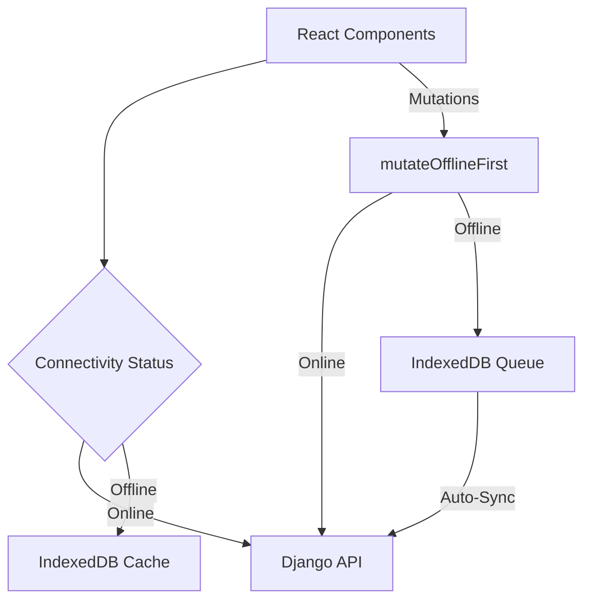

# Arquitectura Offline-First de HomeChef

Esta guía documenta la infraestructura y decisiones técnicas detrás de la capacidad offline-first del frontend de la plataforma HomeChef.

---

## 1. Visión General de la Arquitectura

HomeChef implementa una arquitectura híbrida **Online-First con Fallback de Caché y Cola de Mutaciones**. El sistema prioriza el consumo en tiempo real de las APIs del backend de Django y, ante desconexión o latencia, recurre a IndexedDB y encola transacciones pendientes para auto-sincronizar al reconectar.

---

## 2. Componentes Principales

La arquitectura offline reside en el directorio `src/shared/services/` y `src/shared/hooks/`:

### A. Capa de Red y Conectividad
* **[connectivityService.js](file:///c:/Users/Leonardo/Downloads/Proyecto%20sw1/Homechef-2.0-Frontend/src/shared/services/connectivityService.js)**: Servicio central de conectividad. No se fía únicamente de `navigator.onLine` (que solo detecta conexión a un router local). Ejecuta pings reales de salud (head checks) al backend (`/admin/sync/status`) y al servicio de IA (`/health`) con timeouts de 5s a intervalos de 45 segundos.
* **[useConnectivity.js](file:///c:/Users/Leonardo/Downloads/Proyecto%20sw1/Homechef-2.0-Frontend/src/shared/hooks/useConnectivity.js)**: Hook React que permite a los componentes escuchar y redibujarse ante variaciones de red, recuento de cola pendiente o conflictos.

### B. Capa de Almacenamiento Local (IndexedDB)
El sistema utiliza dos bases de datos IndexedDB distintas para garantizar la confidencialidad del módulo de administración:
1. **`homechef_offline`**: Almacena el caché de Chef, Cliente y Rider.
2. **`homechef_admin_offline`**: Almacena exclusivamente los datos del panel de Administración.

Estructura de almacenes (Stores):
* `entities`: Copia local de registros (platos, pedidos, perfil) con clave primaria `modulo:id` para lecturas sin red.
* `operations` / `offline_mutation_queue`: Cola FIFO de peticiones de escritura pendientes.
* `metadata`: Claves de sesión, tokens de geolocalización, hashes de reportes y timestamps de última sincronización.
* `mappings`: Tabla hash para asociar IDs temporales locales (`local-xxx`) con IDs autogenerados por el backend (`uuid`).

### C. Patrón Staging de Sincronización
Para prevenir la pérdida de datos si la conexión falla a mitad del proceso de pull:
1. Al descargar cambios, el frontend escribe los datos en un módulo temporal con sufijo `_staging`.
2. Una vez descargado todo el paquete, se valida la integridad de los datos.
3. Se borra la base activa (`clearModuleEntities`) y se promueve el staging a producción (`commitStagingToLive`).
4. Si la descarga se corta, el caché anterior permanece intacto.

---

## 3. Registro de Service Worker

El Service Worker está ubicado en `public/sw.js` y se registra desde `src/main.jsx`.
* **Precaché**: Almacena el App Shell principal (`/`, `index.html`, manifest y favicon) usando una estrategia **Network-First** para asegurar que el usuario tenga la versión más actualizada si tiene red, y caiga a la versión local si está offline.
* **Assets Estáticos**: Archivos CSS, JS e imágenes estáticas aplican **Cache-First** con actualización en segundo plano para acelerar el renderizado.
* **Ignorados**: Las rutas dinámicas de la API (`/api/`, `/sync/`) y el socket de desarrollo Vite HMR son ignorados explícitamente para evitar bloqueos.
