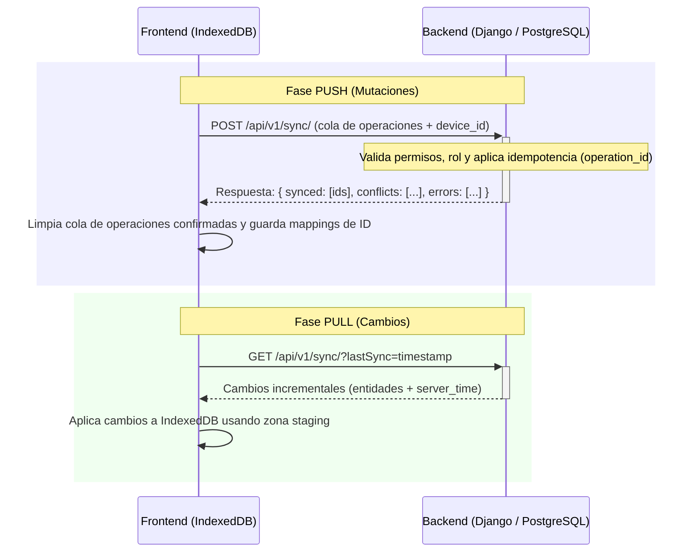

# Flujo de Sincronización de Datos y Conflictos

Este documento describe detalladamente la secuencia de sincronización (Push/Pull), la resolución de identificadores locales y el ciclo de vida de los conflictos en el entorno offline-first de HomeChef.

---

## 1. El Ciclo de Sincronización (`syncNow`)

La sincronización se activa automáticamente ante eventos del navegador (al volver a tener conexión) o de forma manual mediante el botón de la interfaz. Se ejecuta a través de `sync_service.js` siguiendo este orden:

---

## 2. Fase de Envío (Push) e Idempotencia

Cada mutación realizada sin conexión genera un registro en la cola `operations`. 
* **`operation_id` (Idempotency Key)**: Al crearse en la cola local, se le asigna un UUID único. Si la petición falla por micro-cortes tras haber sido recibida en Django, un segundo intento de envío enviará el mismo `operation_id`. El backend revisa si ya procesó este UUID en el repositorio `SyncOperation` y devuelve el resultado guardado anteriormente sin re-ejecutar el cambio de base de datos.
* **Resolución de Mapeo de Identificadores (Local ID a Server ID)**: 
  Si el usuario crea un plato offline, se le asigna un ID local temporal (ej: `local-1234`). Al sincronizar, el backend inserta el plato con un ID incremental real (ej: UUID `8a7b-324d`).
  La respuesta incluye este mapa, el cual es guardado en IndexedDB (`mappings`). Cualquier mutación posterior en la cola que referencie a `local-1234` es corregida dinámicamente con el ID del servidor `8a7b-324d` antes de ser despachada.

---

## 3. Fase de Recepción (Pull)
El pull es incremental. Se envía el timestamp `lastSync`.
1. El backend evalúa la fecha de modificación (`updated_at` / `created_at`) de los recursos asignados al rol y usuario logueados.
2. Si un recurso tiene fecha de eliminación (`deleted_at`), el backend lo reporta en la lista de eliminados.
3. El frontend marca el borrado lógico local (`markLocalEntityDeleted`) o actualiza los registros en IndexedDB.

---

## 4. Gestión de Conflictos
Si el backend detecta que la versión del recurso enviada por el cliente es inferior a la guardada en PostgreSQL (por ejemplo, porque otro dispositivo modificó el mismo plato antes):
1. El backend rechaza la operación e introduce un registro en `conflicts` con la razón `SERVER_VERSION_NEWER`.
2. La mutación en la cola local pasa a estado `conflict` (no se elimina automáticamente para prevenir pérdida de trabajo).
3. El frontend muestra la lista de conflictos detectados en el componente `OfflineConflictsPanel`.
4. Las mutaciones con estado `failed` o `conflict` permanecen en la cola hasta que el usuario decida forzar la sobreescritura o descartarla.
